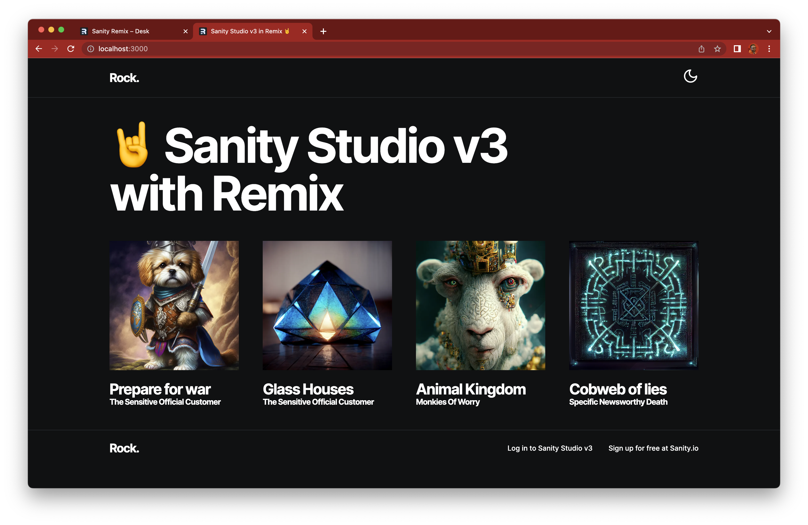
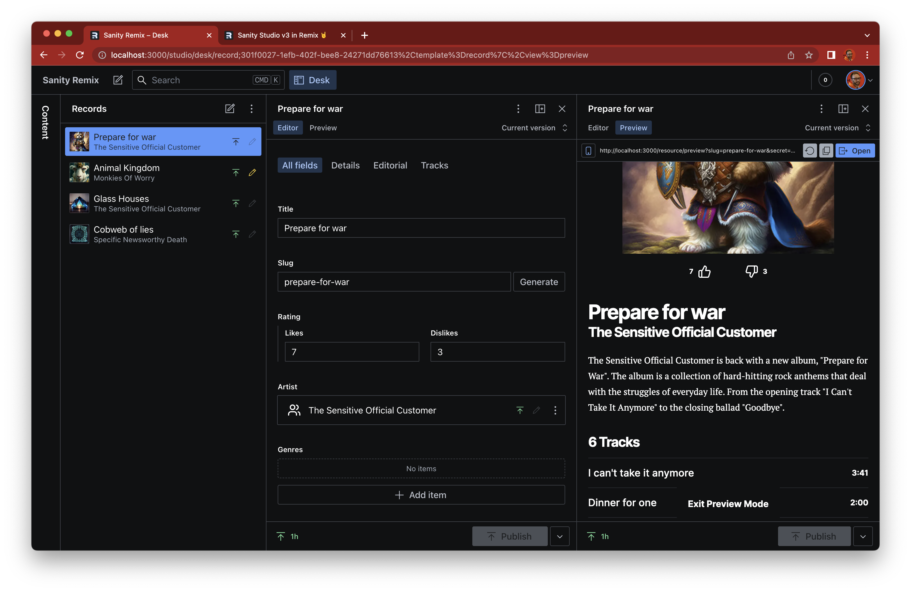

# Sanity Studio + Remix Template

Batteries-included website template for a content-editable, live-preview enabled Remix website powered by Sanity Studio v3.



[Sanity Docs](https://sanity.io/docs) | [Remix Docs](https://remix.run/docs)

## Installation

From the command line, install this project as a Remix template:

```sh
npx create-remix@latest --template SimeonGriggs/sanity-remix-template
```

After setup, `npx sanity@latest init --env` will run to populate your `.env` file with the details of a new or existing Sanity Project's ID and dataset name'.

```sh
npm run dev
```

Now open the Studio at [localhost:3000/studio](http://localhost:3000/studio) and start authoring content!



## Includes

Useful Sanity examples with a light sprinkling of opinionated patterns

### Embedded Studio

Access to Sanity Studio v3 from within the Remix application itself. Now the whole Studio is a component, it lives at the `/studio` route.

### Live preview

Powered by [@sanity/preview-kit](https://github.com/sanity-io/preview-kit)

Requires a token with **viewer** permissions in `.env`, so that live preview links can be shared with guests. Uses an auto-generated, short-lived secret in the dataset to authenticate users to use the token in their session.

### Pre-configured Studio

The Studio has been pre-configured with a basic "Record Collection" schema, as well as a basic Desk Structure to include live preview within a view pane.

### Portable Text component

Powered by [@portabletext/react](https://github.com/portabletext/react-portabletext)

This component allows for the customisation and extension of how Portable Text is rendered within your app. The Rich Text field in Sanity is an array of objects. Content as data!

### Image URL builder

Powered by [@sanity/image-url](https://github.com/sanity-io/image-url)

The `<RecordCover />` component has an example of how to generate a full Sanity CDN asset URL based on just the asset's ID. This is useful as we do not need to resolve the full image document in the query.

### Example decorated input

Powered by [@sanity/ui](https://www.sanity.io/ui)

Creating "decorated" inputs has never been easier than in Sanity Studio v3. `./app/sanity/components/Duration.tsx` is a 13-line example where a `number` field type to store duration as seconds can also be visualised in minutes. Minimal developer effort, maximum author impact.

### Sanity Client mutation

Powered by [@sanity/client](https://github.com/sanity-io/client)

Requires a token with **editor** permissions in `.env`. Clicking the like/dislike buttons on a Record's page will trigger a Remix action which will send a mutation to the document. This is an example of how user actions on the site may trigger changes on your Sanity dataset.

### Typed and validated responses

Powered by [Zod](https://zod.dev/)

The results of the Sanity query in `./app/routes/$slug.tsx` are parsed with a Zod validator. This ensures that content is always returned in the expected shape at **run time**, and auto-generates Types which are fed from the `loader` into `useLoaderData()`.

### Dynamic OG Image

The `record` type generates dynamic open graph images using the `~/routes/resource.og` resource route.

### Other development choices

- eslint and Prettier
- Tailwind CSS with presets by [@sanity/demo](https://github.com/sanity-io/demo)
- Tailwind Prose and Prettier plugins

## Sanity Studio

Visit `https://localhost:3000/studio` in your Remix app. You will need to:

1. Rename `.env.template` to `.env`
2. Set the correct Project ID, Dataset Name and preferred API Version from a project in your [Sanity Manage](https://sanity.io/manage)
3. Add `http://localhost:3000` to the CORS settings on that project, with Allow Credentials privileges

## Deployment

First, build your app for production:

```sh
npm run build
```

Then run the app in production mode:

```sh
npm start
```

Now you'll need to pick a host to deploy it to.

### DIY

If you're familiar with deploying node applications, the built-in Remix app server is production-ready.

Make sure to deploy the output of `remix build`

- `build/`
- `public/build/`

### Using a Template

When you ran `npx create-remix@latest` there were a few choices for hosting. You can run that again to create a new project, then copy over your `app/` folder to the new project that's pre-configured for your target server.

```sh
cd ..
# create a new project, and pick a pre-configured host
npx create-remix@latest
cd my-new-remix-app
# remove the new project's app (not the old one!)
rm -rf app
# copy your app over
cp -R ../my-old-remix-app/app app
```
